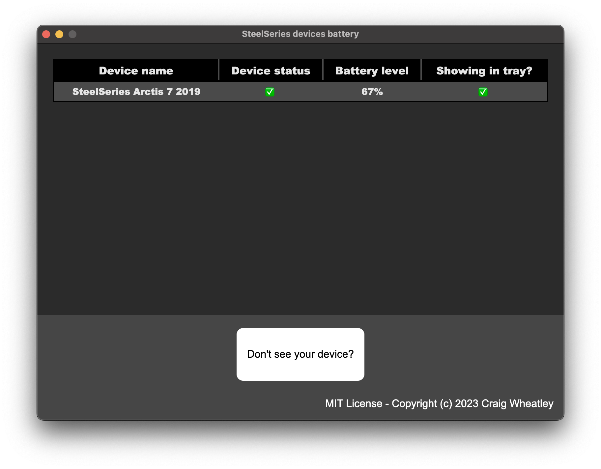

# SteelSeries wireless headset battery app

This is inspired by the amazing work by atagulalan. His work can be found here: [https://github.com/atagulalan/arctis-battery-percentage](https://github.com/atagulalan/arctis-battery-percentage)

The application is using electron and electron-forge to generate an installable Windows application.

The application has a window which be used, but the main purpose of the application is to have a dynamic tray icon, which refreshses every 2 seconds. This tray icon will either show a disconnected icon, or the battery percentage as an integer.

Currently only one device can be shown in the tray; I'm planning a way to change the device shown in the future.

If you don't see your device listed, please use the button to generate the device information for that unsupported device. Please open a github issue or contact me to send me that information and I will try to add the device.

### Screenshot

## Usage
Download the `zip` from the releases page.

Extract and run the `setup` application.

This will run an installer and then run the application.

## Known limitations
- You have to manually set the application to start with Windows; I'm looking into a solution for this.
- Only one device can be shown in the tray at one time.

## How to build yourself

run `npm install`

run `npm run make`

## License

MIT license. More info can be found in LICENSE file.

## Credits

inspired by [atagulalan](https://github.com/atagulalan)
