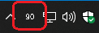

# SteelSeries wireless headset battery app

This is inspired by the amazing work by atagulalan. His work can be found here: [https://github.com/atagulalan/arctis-battery-percentage](https://github.com/atagulalan/arctis-battery-percentage)

The application is using electron and electron packager to generate a win32 application.

The application has a window which _can_ be used, but the main purpose of the application is to have a dynamic tray icon, which refreshses every 2 seconds. This tray icon will either show a disconnected icon, or the battery percentage as an integer.

### Screenshot

## How to build

run `npm install`

run `npm run build`

## License

MIT license. More info can be found in LICENSE file.

## Credits

inspired by [atagulalan](https://github.com/atagulalan)
